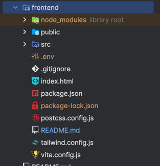

# Data Platform Frontend

## Project setup
    npm install

### Before startup
You need to either have a local backend running and or use a cloud deployed backend.
Setup a .env file with following variables in the frontend folder, e.g.:

    VITE_ROOT_API=http://localhost:3000

After setting up the .env file, please confirm that the .env file is in the frontend folder in the right place as shown in the picture

### Compiles and hot-reloads for development
    npm run dev

### Username and Password for Login
**Editor Role Creds**  
* Username: admin
* Password: admin

**Viewer Role Creds**
* Username: user
* Password: user
